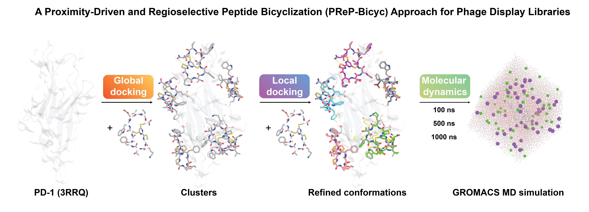

**A Proximity-Driven and Regioselective Peptide Bicyclization (PReP-Bicyc) Approach for Phage Display Libraries**

This repository includes the computational modelling input and scripts for our paper Guoqing Jin, Yifan Shi, Shihui Fan, Lai Hoang Son Le, Wenyue Cao, Thuzar Hla Shwe, Zihan Anna Zhang, Demonta D. Coleman, Satyanarayana Nyalata, Joshua Trae Hampton, and Wenshe Ray Liu (2026). "A Proximity-Driven and Regioselective Peptide Bicyclization (PReP-Bicyc) Approach for Phage Display Libraries" (Unpublished).

To elucidate the structures of PCK1 and PCK2 macrocycles in complex with PD-1, we adopted a two-stage molecular docking approach (global docking and local docking) to previously reported structure of PD-1 (PDB ID: 3RRQ) using GNINA 1.3, followed by an extended run of Molecular Dynamics (MD) simulations utilizing GROMACS. A macrocycle PCK3 (the Abu-deprived analog of PCK2) was also included in the workflow to assess the significance of Abu in the protein-macrocycle interaction. 

The global docking was set to generate up to 100 conformations for each peptide, which were subsequently clustered into different groups based on Root-Mean-Square Deviation (RMSD) of the whole macrocycle (cut-off at 20 Å). 

From there, only the conformations with the best affinity score (kcal/mol) in each group were selected to feed into the flexible local docking steps where the docking grid box was automatically determined based on the position of these representatives. Among all generated conformations, only the one with the most negative affinity in each local docking cluster was extracted as inputs for a 100-ns MD simulation, which could be extended to 500 ns or 1000 ns if the predicted complex became stable during the course of the run. 
